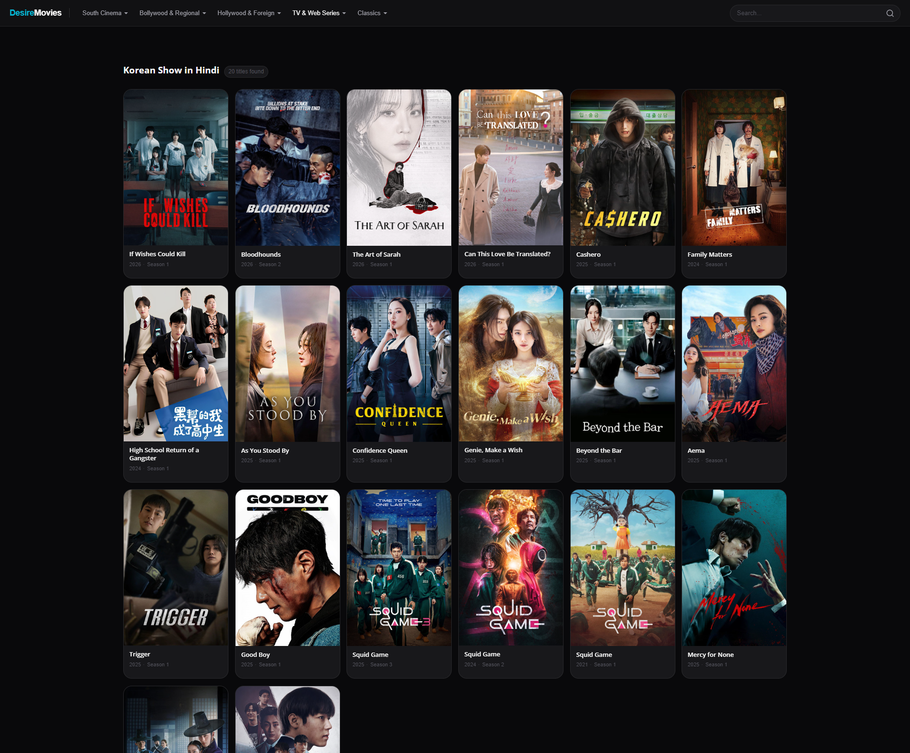
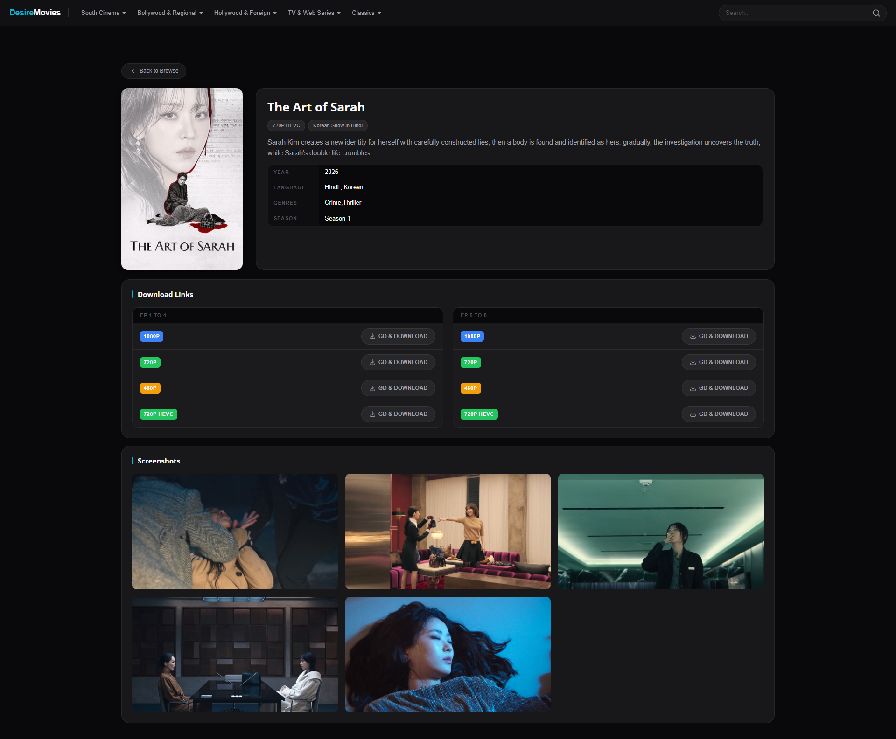
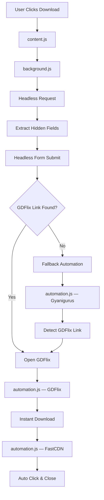

# DesireMovies Reimagined 🎬

A modern Chrome Extension that completely transforms the DesireMovies browsing experience with a Netflix-inspired UI, real-time IMDb ratings, intelligent caching, and a fully automated download bypass engine.

> Built with Manifest V3, optimized for speed, automation, and a clutter-free experience.

---

## ✨ Features

### 🎨 Premium UI Redesign

* Netflix-inspired dark theme
* Glassmorphic sticky navigation bar
* Modern responsive movie cards
* Smooth staggered card animations
* Integrated search experience
* Zero-layout-shift rendering
* Lightweight screenshot gallery with 3-column responsive grid
* Skeleton shimmer loaders for seamless content loading

### ⭐ Live IMDb Ratings

* Automatic title parsing and cleanup
* Real-time IMDb rating retrieval
* JSON-LD metadata extraction
* Local caching using `chrome.storage.local`
* Instant subsequent loads with zero network requests
* Shimmer placeholders during rating fetch
* Resilient fallback displaying: shows N/A and links directly to the title page if the rating is unavailable, instead of hiding the IMDb row

### ⚡ Automated Download Bypass

* One-click download experience
* Background headless redirection engine
* Automatic form submission
* Popup blocking (via `window.open` override in MAIN world where needed)
* Cloudflare-safe fallback workflow
* Automatic GDFlix navigation
* Auto-click Instant Download buttons
* Automatic FastCDN interaction: detects the final download page, waits for the loader to resolve, auto-clicks "Download Here", and closes the tab after 5 seconds
* Self-closing automation tabs

### 📁 Native Filename Auto-Cleaning

* Automatic download name normalization via `chrome.downloads` API
* Cleans up DesireMovies branding, tags (e.g. 10bit, hevc, hd) and dot spacing on-the-fly
* Standardizes TV show episode format (e.g. S01 EP01 or S01 EP01-05)
* 100% native client-side naming overrides directly in the browser, eliminating the need for external scripts

---

## 📸 Screenshots

| Home Page | Movie Details |
|------------|------------|
|  |  |

---

## 🏗 Architecture



---

## ⭐ IMDb Rating Pipeline

1. Movie title is cleaned using the internal parser.
2. IMDb suggestion API is queried.
3. Matching IMDb ID is extracted.
4. IMDb title page is fetched.
5. Rating is parsed from JSON-LD metadata.
6. Result is cached locally.
7. Future requests load directly from cache.

### Supported Title Cleanup

The parser automatically removes:

* Release years
* Resolution tags
* Language tags
* Quality labels
* Bracket annotations
* Regional language identifiers

Examples:

```text
Salaar (2023) Hindi HDRip 1080p

↓

Salaar
```

---

## 🚀 Download Bypass Engine

### Layer 1: Headless Mode

The extension attempts a complete background bypass:

1. Fetch redirect page
2. Extract hidden form inputs
3. Submit form automatically
4. Locate GDFlix URL
5. Open final download page

No visible intermediate pages are shown to the user.

### Layer 2: Automation Fallback

If headless bypass fails:

* Popups are disabled
* Redirect buttons are auto-clicked
* Dynamic links are detected
* GDFlix is opened automatically
* Temporary tabs close themselves

---

## 📋 Script Execution Matrix

| Script          | Target                              | Timing           | Context        | Purpose                                          |
| --------------- | ----------------------------------- | ---------------- | -------------- | ------------------------------------------------ |
| `content.js`    | DesireMovies                        | `document_start` | ISOLATED       | UI rendering, IMDb integration, caching          |
| `automation.js` | GyaniGurus, GDFlix, FastCDN         | `document_start` | ISOLATED       | Redirect automation, auto-click & tab close      |
| `background.js` | Service Worker                      | N/A              | Service Worker | Headless bypass, dynamic injection & renaming    |

---

## 📂 Project Structure

```text
DesireMovies-Reimagined/
│
├── manifest.json
├── background.js
├── content.js
├── automation.js
├── redesign.css
│
├── docs/
│   └── screenshots/
│       ├── home.png
│       └── details.png
│
└── icons/
    ├── icon16.png
    ├── icon32.png
    ├── icon48.png
    └── icon128.png
```

---

## 🛠 Installation

### Option 1: Load Unpacked

```bash
git clone https://github.com/Deepak5310/DesireMovies-Reimagined.git
```

1. Open `chrome://extensions`
2. Enable **Developer Mode**
3. Click **Load unpacked**
4. Select the extension directory
5. Visit DesireMovies

---

## ⚠️ Notes

* Target domains occasionally change.
* Some bypass routes may stop working when upstream providers modify their flow.
* Cloudflare or anti-bot protections can affect automation success rates.
* The fallback automation layer exists specifically to handle such scenarios.

---

## 👨‍💻 Developer

**Deepak Jangid**

GitHub: https://github.com/Deepak5310

---

## 📄 License

This project is provided for educational and personal-use purposes.
