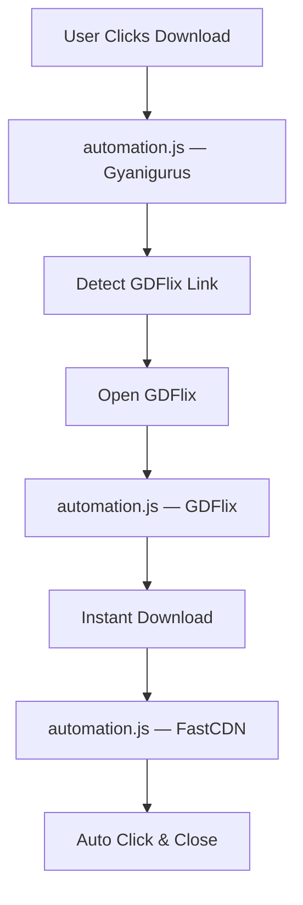

# DesireMovies Automation 🎬

A modern Chrome Extension that automates the DesireMovies download bypass engine and cleanly renames downloaded files.

> Built with Manifest V3, optimized for speed, automation, and a clutter-free experience.

---

## ✨ Features

### ⚡ Automated Download Bypass

* One-click download experience
* Automatic GDFlix navigation
* Auto-click Instant Download buttons
* Automatic FastCDN interaction: detects the final download page, waits for the loader to resolve, auto-clicks "Download Here", and closes the tab after 5 seconds
* Self-closing automation tabs

### 📁 Native Filename Auto-Cleaning

* Automatic download name normalization via `chrome.downloads` API
* Cleans up DesireMovies branding, tags (e.g. 10bit, hevc, hd) and dot spacing on-the-fly
* Standardizes TV show episode format (e.g. S01 EP01 or S01 EP01-05)
* 100% native client-side naming overrides directly in the browser, eliminating the need for external scripts

---

## 🏗 Architecture



---

## 📋 Script Execution Matrix

| Script          | Target                              | Timing           | Context        | Purpose                                          |
| --------------- | ----------------------------------- | ---------------- | -------------- | ------------------------------------------------ |
| `automation.js` | GyaniGurus, GDFlix, FastCDN         | `document_start` | ISOLATED       | Redirect automation, auto-click & tab close      |
| `background.js` | Service Worker                      | N/A              | Service Worker | Filename normalization (renaming) during downloads|

---

## 📂 Project Structure

```text
DesireMovies-Automation/
│
├── manifest.json
├── background.js
├── automation.js
│
└── icons/
    ├── icon16.png
    ├── icon32.png
    ├── icon48.png
    └── icon128.png
```

---

## 🛠 Installation

### Option 1: Load Unpacked

```bash
git clone https://github.com/Deepak5310/DesireMovies-Reimagined.git
```

1. Open `chrome://extensions`
2. Enable **Developer Mode**
3. Click **Load unpacked**
4. Select the extension directory
5. Visit DesireMovies

---

## ⚠️ Notes

* Target domains occasionally change.
* Some bypass routes may stop working when upstream providers modify their flow.
* Cloudflare or anti-bot protections can affect automation success rates.

---

## 👨‍💻 Developer

**Deepak Jangid**

GitHub: https://github.com/Deepak5310

---

## 📄 License

This project is provided for educational and personal-use purposes.
